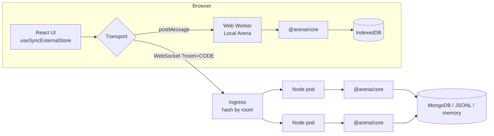

# TripleFind Arena

A real-time multiplayer memory race. Two to four players flip cards on one shared board,
and an authoritative server deals the board and checks every flip. Each match is stored as
an append-only event log, and replays, results and the Elo ladder are rebuilt from that log.

**Play:** [invokfung.github.io/arena](https://invokfung.github.io/arena/). GitHub Pages only
serves static files, so the page runs **Local Arena**: the same server code (`@arena/core`)
in a Web Worker, with bots and an IndexedDB event store. To play against people, point the
page at the Node server with **Connect to server** or `?server=wss://…`.

The rules come from my 2023 single-player [TripleFind](https://invokfung.github.io/triplefind/).

| What it shows | Where |
| --- | --- |
| Authoritative real-time server: clients send intents, the server validates them, applies them and fans the result out | `packages/core`, `apps/server` |
| Event sourcing with optimistic concurrency; replays, results and the ladder as projections | `packages/core/src/store.ts`, `match-runtime.ts`, `ladder.ts` |
| A pure, deterministic engine (seeded RNG, no I/O) that runs unchanged in Node, a Web Worker and the page | `packages/engine` |
| Hidden information and provably fair deals (SHA-256 commit/reveal) | `engine/src/view.ts`, `deck.ts`, `replay.ts` |
| A typed protocol: discriminated unions, every client message validated at runtime, no `any` | `packages/protocol` |
| Tests against real WebSockets, a real file store and a real MongoDB | `*/test` |
| Operability: health, readiness, Prometheus metrics, graceful drain, Docker, Compose, Kubernetes | `apps/server/src/host.ts`, `Dockerfile`, `infra/k8s` |
| Measured performance from a load generator running real WebSocket clients | `tools/loadtest` |

## Measured

All numbers come from commands in this repo (`npm test`, `npm run loadtest`,
`npm run facts`). They were taken on one 4 vCPU Intel Xeon @ 2.10 GHz VM with Node 22,
with the load generator and the server running **on the same machine**, while other jobs
were also running on it. Read them as orders of magnitude.

**Tests: 50 / 50 pass** (19 engine, 3 protocol, 14 core, 14 server). The MongoDB contract
tests ran against a real `mongo:7`; without `ARENA_TEST_MONGO_URL` those 4 tests are skipped.

**Load** (`npm run loadtest -- --clients N --duration 30`). Each client is a bot that queues
for quick match, plays whole 4-player matches and re-queues. A client flips 3–5 times a
second, which is faster than a person.

| Clients | Matches finished/s | Flips/s | Frames out/s (server) | Flip RTT p50 / p99 / max | Server flip handling p99 | Server CPU (% of 1 core) | Server RSS |
| ---: | ---: | ---: | ---: | --- | ---: | ---: | ---: |
| 200 | 6.6 | 286 | 2,937 | 0.32 / 1.6 / 13 ms | ≤ 1 ms | 9 % | 127 MiB |
| 1,000 | 30.3 | 1,491 | 15,135 | 0.32 / 2.7 / 19 ms | ≤ 0.25 ms | 33 % | 164 MiB |
| 2,000 | 60.7 | 2,952 | 30,034 | 1.1 / 34 / 79 ms | ≤ 0.25 ms | 55 % | 289 MiB |

The flip RTT clock starts when a client sends a flip. It stops when that client receives
the server's `card_flipped` for it. In between, the server validates the flip, applies it,
appends it to the write-behind buffer and broadcasts it to the 4 players.

At 2,000 clients the server's own handling time stays at or under 0.25 ms at p99, while the
p99 round trip grows to 34 ms. The load generator (one Node process holding 2,000 sockets)
and the shared CPU are what saturate, not the server, which uses about half a core. I did
not run the generator on separate machines, so the server's real ceiling is unmeasured.

The raw results are in `tools/loadtest/results/*.json`. `compose-mongo-40.json` is a
smoke run against the Docker Compose stack with the MongoDB store.

**Bundle** (gzip -9): the page JS is 90 kB and the worker is 15 kB. The worker contains the
whole server: engine, protocol validation, matchmaking, bots and the IndexedDB store.

**Bots**: `npm run calibrate` runs 60 seeded solo boards per level.

| Level | Think time | Memory | 12 cards cleared | 18 cleared (avg score) | 24 cleared |
| --- | --- | --- | ---: | ---: | ---: |
| Rookie | 0.8–1.4 s | 8 cards, half-life 15 s | 97 % | 100 % (2,535) | 97 % |
| Adept | 0.65–1.2 s | 10 cards, half-life 20 s | 100 % | 100 % (3,732) | 100 % |
| Ace | 0.42–0.8 s | 20 cards, half-life 60 s | 100 % | 100 % (4,765) | 100 % |

## Architecture



```
packages/engine    pure game: rules, seeded deal, decide(state, cmd) -> events, apply(state, event),
                   public view, bots' minds, replay/verification. lib ES2022, types [] -> no DOM, no Node.
packages/protocol  message types + a small runtime validator (strict objects, tagged unions, bounds).
packages/core      ArenaServer: sessions, rooms, quick-match queue, MatchRuntime (timers, write-behind),
                   BotClient, ladder projection, metrics, EventStore interface + in-memory store.
                   Transport-agnostic: it sees Connections, a Scheduler, a RandomSource, a SessionAuthority.
apps/server        Node host: ws + http (/ws, /healthz, /readyz, /metrics), HMAC resume tokens,
                   JSONL file store, MongoDB store, config from env, SIGTERM drain. Bundled by esbuild.
apps/client        Vite + React 19. WorkerTransport (Local Arena) or SocketTransport (backoff, routing key).
tools/loadtest     N BotClients over real WebSockets; percentiles, CPU from /proc; facts + calibration.
infra/k8s          Namespace, ConfigMap, Secret example, Deployment, Service, Ingress, HPA, PDB.
```

The same `ArenaServer` class runs in three places:
- in the Node server, with real sockets;
- in the browser worker, where `postMessage` is the transport;
- in tests, with a manual virtual clock (`ManualScheduler`), which makes timer-heavy match logic (countdowns, reveal windows, idle release, time-outs) deterministic.

### How a flip travels

1. The client sends `{"type":"flip","matchId":"m_…","card":7,"ref":42}`.
2. The host drops binary frames and frames over 4 KiB. The core parses the JSON and validates it against the protocol schema: unknown fields are rejected, and so are prototype keys and out-of-range numbers. It then charges a per-connection token bucket (40 burst, 20/s; 20 strikes closes with 4008).
3. `MatchRuntime.flip` calls `decideFlip(state, player, card, now)`. That is pure and returns events or a reject code (`card_unavailable`, `resolving`, `time_up`, …).
4. The events are applied with `applyEvent`, given sequence numbers and appended to a per-match write-behind buffer. That buffer is flushed in batches through `EventStore.append(matchId, expectedSeq, events)`.
5. Every participant gets `match_event {seq, event}` with the **public** projection of the event. Each frame is serialised once and shared by all recipients. Spectators get the same stream.
6. The flipping client gets an `error` with the same `ref` if the move was refused.

## The game, on one shared board

These are the rules of the original game, ported unchanged:
- Clear every triple before the timer ends. The time limit is `floor(6·(n/3)²/1.85)+13` seconds.
- A triple is worth `remaining/limit × 1000` points, rounded to 10. Below half time it is a flat 500.
- A failed triple that re-flips a card that was already seen costs 200. The score never goes below 0.
- Room boards take 6–36 cards. The page also caps the count at what the screen can show. Quick match uses `12 + 3 × players` cards.

What multiplayer adds:
- Every player sees one board.
- A card that is up in someone's selection is locked for everyone else.
- A finished triple is gone for everyone.
- After a mismatch the cards stay up for 0.8 s (everyone sees them), then flip back.
- A selection left idle for 6 s is released.
- **Stalemate rule:** if no card is face down and nobody is resolving a mismatch, every partial selection flips back after 0.7 s. Otherwise the last triples could be split between players forever.

## Protocol

JSON text frames over one WebSocket (`/ws`). Both directions are discriminated unions in
`packages/protocol/src/messages.ts`, shared by the server, the worker, the page and the load
generator.

- **Client → server**: `hello`, `set_name`, `create_room`, `update_room`, `join_room`, `leave_room`, `start_match`, `queue_join`, `queue_leave`, `flip`, `focus`, `leave_match`, `spectate`, `unwatch`, `sync`, `list_live`, `list_replays`, `get_replay`, `get_ladder`, `ping`.
- **Server → client**: `welcome`, `error`, `room`, `queue`, `match_snapshot`, `match_event`, `presence`, `match_summary`, `live_list`, `replay_list`, `replay`, `ladder`, `pong`.

How a session and a match proceed:
1. **Handshake.** The client sends `hello {protocol: 1, name, token?}`. The server answers `welcome {playerId, token, serverTime, rating}`. The token is a stateless HMAC-SHA256 resume token (`playerId.signature`). Any replica with the shared secret can verify it, so a dropped player who reconnects resumes the same seat, even on another pod.
2. **Joining a match.** The client gets `match_snapshot` (the public state and its `seq`) and then `match_event`s in order. If a client sees a sequence gap, it sends `sync` and gets a fresh snapshot.
3. **Attention.** `focus` shares which card a player is looking at, and other players see it live as seat-coloured dots on the board. It is throttled per player.

Socket close codes:
- **4400**: protocol mismatch.
- **4001**: superseded by a newer socket for the same player.
- **4008**: rate limited.
- **1009**: frame too big.
- **1012**: server restarting (drain).
- **1013**: client too slow (over 1 MB buffered).

## How cheating is prevented

- **The client holds no secrets.** The deal exists only on the server. The public view (`toPublicView`) has a `null` value for every face-down card, including cards that were seen before: the page has to remember them, the same way a player does. Snapshots never resend flipped-back values.
- **The seed is hidden until the match ends.** `match_created` holds the seed and is never streamed live. `get_replay` is refused while a match is live, so a player cannot download the log mid-game.
- **Every move is checked by the engine.** It checks: is it your match, is the match running, is the card in range and face down, is it free, are you mid-resolution, has time run out. A forged `playerId` in a message does nothing, because identity comes from the socket's session. Spectators cannot flip.
- **The deal is provably fair.** Before the first flip the server publishes `commitment = sha256("triplefind-arena/commit/v1:" + seed)`. The deck is a Fisher–Yates shuffle driven by xoshiro128** seeded from `sha256("…/deal/v1:" + seed)`. At the end the seed is revealed and the client checks two things in `verifyDeal`: that the seed hashes to the commitment, and that the deck it produces matches every card that was shown. The results screen and the replay show the verdict.
- **Abuse limits.** Frames are capped at 4 KiB. Validation is strict and covers unknown keys, `__proto__` and number bounds. Each connection has a token-bucket rate limit, and sockets come only from an origin allow-list (`ARENA_ALLOWED_ORIGINS`).

What this does not prevent: a script that clicks for you and remembers perfectly, and two
players who collude in one room. These are outside what a server can see.

## Event sourcing and replays

- **Events.** `match_created`, `match_started`, `card_flipped {reflip}`, `triple_claimed {points}`, `triple_failed {penalty}`, `selection_cleared {reason}`, `match_finished {seed, standings}`.
- **Pure engine.** `decide*` functions turn a command into events, and `applyEvent` folds them into state, so `foldEvents(log)` is the match. The engine never reads a clock: time is an argument.
- **The store.** `EventStore` has `append(matchId, expectedSeq, events)`, `load`, `recentFinished`, `allFinished`, `healthy` and `close`. An append with a stale `expectedSeq` throws `ConcurrencyError`. One contract test suite runs against every implementation:
  - **memory** (default);
  - **JSONL file**, an append-only log with a serialised writer that tolerates a torn last line, with optional fdatasync;
  - **MongoDB**, a unique `(matchId, seq)` index where a duplicate key means a concurrency conflict;
  - **IndexedDB**, used by the worker. It is not covered by the contract tests, because Node has no IndexedDB.
- **Write-behind.** The runtime appends in batches per match, and match results are only announced after the final flush.
- **Projections.**
  - **Replay:** the client folds the stored log with the same reducer. The scrubber binary-searches events by time. "X-ray" overlays the deal recomputed from the revealed seed.
  - **Ladder:** a pairwise Elo for free-for-all play (K = 32, each pair worth K/(n−1)). Bots are fixed anchors at 1000, 1200 and 1400. Applying a match is idempotent by `matchId`, and on startup the ladder is rebuilt from `allFinished()`.
  - **Summaries:** the lists of recent replays.
- **Replay = live, tested.** The server test plays a full match over WebSockets, then rebuilds the result from the stored log and compares the two. The core tests check that a ladder rebuilt from the store equals the live ladder, and that this survives a restart.

## Running it

Everything happens in `arena-src/` and needs Node 22.

```sh
npm install
npm test                     # 50 tests (4 MongoDB tests skip unless ARENA_TEST_MONGO_URL is set)
ARENA_TEST_MONGO_URL=mongodb://127.0.0.1:27017 npm test
npm run typecheck
npm run build                # typecheck + client into ../arena + server bundle into apps/server/dist

npm run dev:server           # ws://localhost:8782/ws, in-memory store, hot reload
npm run dev:client           # http://localhost:5174/arena/?server=ws://localhost:8782/ws
node apps/server/dist/server.mjs   # the production bundle

npm run loadtest -- --clients 1000 --duration 30   # starts its own server on :8790
npm run facts -- --load 1000 && npm run build:client   # refresh the numbers shown on the page
npm run calibrate            # bot difficulty table
```

The server is configured through environment variables:

| Variable | Default | Meaning |
| --- | --- | --- |
| `PORT` | `8782` | Port to listen on. |
| `HOST` | `0.0.0.0` | Address to bind. |
| `ARENA_STORE` | `memory` | Event store: `memory`, `file` or `mongo`. |
| `ARENA_FILE` | `./data/events.jsonl` | File-store path. `ARENA_FILE_FSYNC=1` turns on fdatasync. |
| `ARENA_MONGO_URL`, `ARENA_MONGO_DB` | none, `triplefind_arena` | MongoDB connection and database. |
| `ARENA_SESSION_SECRET` | none | HMAC key for resume tokens. Set it, and share it across replicas. |
| `ARENA_ALLOWED_ORIGINS` | none (any origin) | Comma-separated browser origins allowed to connect. |
| `ARENA_FILL_MS` | `3000` | How long quick match waits for humans. |
| `ARENA_BOT_FILL_MS` | `8000` | When bots fill a table, or `off`. |
| `ARENA_DRAIN_MS` | `0` | How long `/readyz` reports 503 on SIGTERM before sockets close. |
| `LOG_LEVEL` | `info` | Log level. Logs are JSON lines. |

### Docker and Compose

```sh
docker build -t triplefind-arena .
docker compose up --build                   # :8782, JSONL store on a volume
docker compose --profile mongo up --build   # adds mongo:7 and a second server on :8783 using it
```

The image is multi-stage:
1. The first stage runs `npm ci` for the server workspaces only and bundles the server with esbuild.
2. The runtime stage is `node:22-alpine` plus one bundled file: no `node_modules`, no compiler, no source. It runs as `node` (uid 1000) with a `HEALTHCHECK` on `/healthz`.

Behind a TLS-intercepting proxy, add `--secret id=npm_ca,src=ca.pem --build-arg HTTPS_PROXY=…`.

### Kubernetes (`infra/k8s`, `kubectl apply -k infra/k8s`)

The Deployment runs 2+ replicas with the MongoDB store and is locked down:
- runs as non-root with a read-only root filesystem;
- drops all capabilities and uses the `RuntimeDefault` seccomp profile;
- does not mount a service-account token.

It has startup, liveness (`/healthz`) and readiness (`/readyz`) probes. Readiness returns
503 while the store is unreachable and while the pod drains. A
`terminationGracePeriodSeconds` of 45 covers `ARENA_DRAIN_MS` (10 s) plus the final flush.
The HPA scales on CPU between 2 and 8 replicas and scales in slowly. The PDB keeps
`minAvailable: 1`.

**Room affinity.** A live match lives in one process's memory, so every player in a room
must reach the same pod.
- Before it creates or joins a room, the client reconnects with `?room=CODE`. The client proposes the code, so the code is known before the room exists. Before quick match, it reconnects with `?room=quick`.
- The Ingress uses ingress-nginx `upstream-hash-by: "$arg_room"`, which is consistent hashing. The room code is the shard key, and scaling out moves only about 1/N of the keys.
- The resume token works on any pod, so being rerouted costs only a reconnect.
- Cookie affinity would not work here: two friends in two browsers have two different cookies.

## What was validated, and what was not

**Validated here:**
- **Tests and build.** All 50 tests pass, the typecheck passes, and the client and server build.
- **Browser runs.** Headless Chromium drove the built client at 1440×900 and 390×844 with no console errors and no horizontal scroll:
  - Local Arena quick matches against bots, played to the end, followed by the replay and the ladder;
  - through the real Node server: a room with two browser players and a bot, joined with an invite link, with a third browser spectating from "Live now" (a check of the spectator's DOM mid-match found no face-down value), then back to the room;
  - a quick match through the Docker image.
- **Load test.** The figures above were measured.
- **Docker.**
  - The image built, and `docker compose --profile mongo up` ran both services.
  - Matches were played against both. Events landed in the JSONL file and in MongoDB, which had the expected indexes.
  - `docker compose stop` drained cleanly (exit code 0), and a restart rebuilt the ladder from the file.
  - Stopping MongoDB turned `/readyz` to 503, and it recovered when MongoDB came back.
  - The image also ran with `--read-only --cap-drop ALL`, as the Deployment requires.
- **Kubernetes manifests.** All of them pass strict schema validation against Kubernetes 1.31 (`kubernetes-validate --strict`).

**Not validated:**
- The manifests were never applied to a cluster. HPA behaviour, the ingress-nginx hashing and the rolling-update drain are untested.
- Nothing is deployed. There is no public server, so the published page runs Local Arena unless you connect it to a server you run.
- Load from separate machines, and real-world network latency.
- A replica set or sharded MongoDB, and Mongo outages during a live match. The flush retries, but this was not exercised.

## Limitations and next steps

- **One process per match.** A pod crash loses the live matches on it. Their logs are complete up to the last flush, but the match cannot continue on another pod, because only finished matches are replayable. Moving live matches would need the log to be re-hydrated on the new owner, plus a lease.
- **Per-replica views.**
  - **Ladder:** each replica rebuilds the ladder from the shared store at startup but updates it only for matches it hosts. Ratings on other pods drift until they restart. A change stream or periodic refresh would fix this.
  - **Live now:** each replica lists only its own matches.
  - **Quick-match queue:** one shard (`?room=quick`). Past roughly one pod's capacity it would need sharding by region or skill, or a shared queue.
- **Identity.** It is anonymous: there are no accounts. A resume token is the identity, so clearing site data gives you a fresh rating.
- **Local Arena** is single-player against bots. Its IndexedDB store keeps your replays and ladder in that browser only.
- **Bots and the endgame.** Bots are tuned for fun rather than optimal play. Very fast, greedy players can still split the last triple repeatedly. The stalemate rule breaks the deadlock when every card is held, but not when one card is still free.
